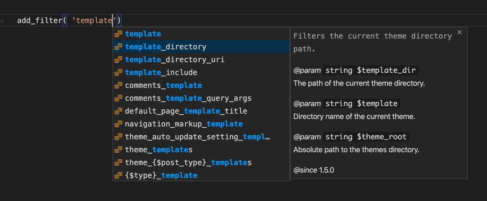
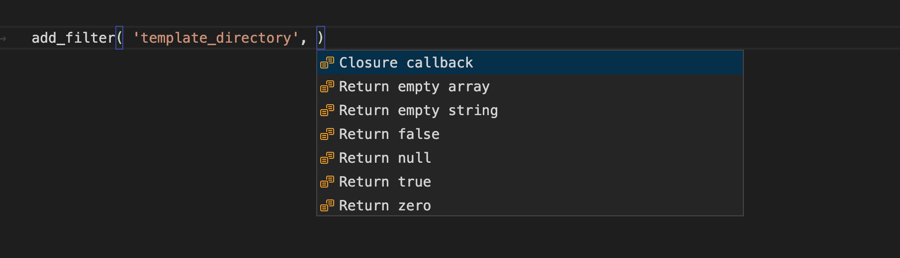

# WordPress Hook Autocompletion for VS Code

This extension adds autocomplete support for WordPress action and filter names.

## Usage

Start typing the name of a WordPress action or filter within `add_action()` or `add_filter()` and you'll get an autocomplete list of all matching actions or filters, plus information about the parameters and usage:

[](images/screenshot-1.png)

Autocomplete is also provided for the callback function and other built-in callbacks to save you keystrokes:

[](images/screenshot-2.png)

An autocompleted closure callback looks like this:

```php
add_filter( 'template_directory', function( $template_dir, $template, $theme_root ) {
    |
}, 10, 3 );
```

## License

This extension is free and open source software. It's licensed under the GPLv3.

## Thanks

* This extension uses the [wp-hooks library](https://github.com/johnbillion/wp-hooks) as the hook information provider.
* This extension uses some code inspired by the [Autocomplete WordPress Hooks extension for Atom](https://github.com/joehoyle/atom-autocomplete-wordpress-hooks).
